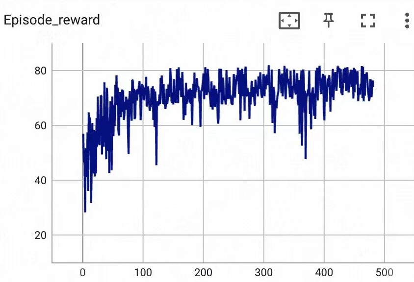

# RELSA
This is the source code repo for ASPLOS'24 paper submission.

## Install

```bash
pip install -r requirements.txt
```

## Hardware Configuration

We have provided three feasible archive storage hardware configurations and stored them in `data/hw_setup.json`. For further informantion please refer to our paper. To set hardware configuration 1, you can use `--hardware 1` when running `main.py` to start the training.

## Train

Basically, run `python main.py --mode train` can start training a model with the default parameters.

Here is an example to train a RELSA model with self-defined parameters on simulated trace.

`python main.py --mode train --hardware 1 --max_time 3000 --workload_rate 4 --archive_rate 0.5 --urgent_flag False --chunk_num 100 --bad_disk_num 0 --scrub_flag False --act_threshold 0.85 --batch_size 64 --pos_weight 0.3 --update_timestep 1024 --save_timestep 10000 --eval_episode 1000`

## Test

Here is an example to test an already trained model, note that the following parameters should be the same as the trained model.

`python main.py --mode test --hardware 1 --max_time 3000 --workload_rate 4 --archive_rate 0.5 --model_name best`

## Visualize

Use tensorboard to visualize the training process, and the results are saved in `train/`. Here is a training process example:


